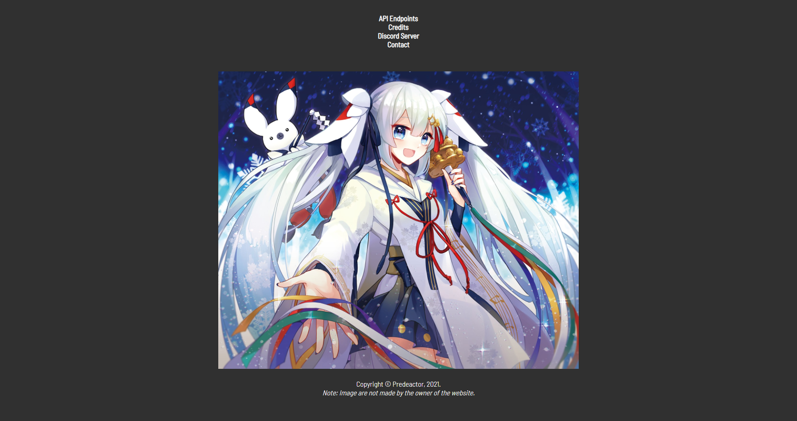

# Introduction to v1


MikuAPI v1 is no longer usable since v2! No data (images) will be returned from v1 anymore.



The original website of v1 does no longer exist.

It was existing under [https://mikuapi.predeactor.net](https://mikuapi.predeactor.nt) and has been moved with the new domain, [https://miku-for.us](https://miku-for.us)



## Technologies

MikuAPI v1 technologies are the following:

* Fastify - [https://www.fastify.io/](https://www.fastify.io)

#### Fastify's Modules

* fastify-rate-limit
* fastify-static

## Purposes

The purpose of v1 was to only return a random image of Hatsune Miku by reloading the page. The page's color was grey and was listing the contributors of the API.

It is the first JavaScript's project made by Predeactor, the MikuAPI's maintainer.

Images were provided by DiamondLP.

The favicon was realized by Miss\_TeaRex.

The website was hosted by Predeactor, at [https://mikuapi.predeactor.net](https://mikuapi.predeactor.net).

The project contain 27 commits, and was made using JavaScript.
